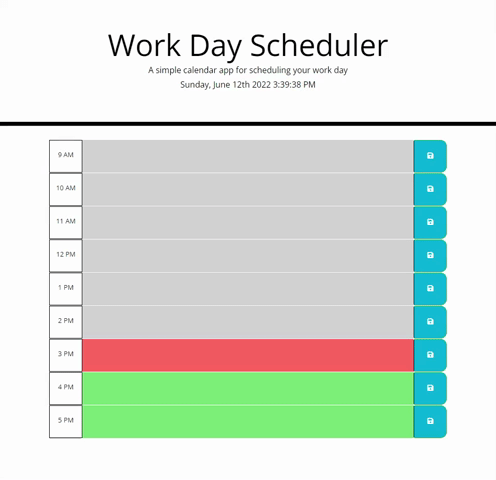

# Work Day Scheduler

## Table-of-Contents

- [Description](#description)
- [Deployed Site](#deployed-site)
- [Features](#features)
- [Technologies](#technologies)
- [Future Development](#future-development)
- [Credits](#credits)

## Description

This application allows users to keep track of tasks in a kanban-style board that automatically updates its styling based on the time of day. This application allows a user to load the page and view their local time of day dynamically change on their page. Below, there are task bars that allow users to input and save text as "tasks", which are then saved to their local storage. Because of this, the tasks remain even after refreshing the page. The task bars appear grey when that time of day has already passed, green when that time of day is in the future, and red for the current time.

## Deployed Site

Follow [this link](https://ashlynn4567.github.io/Work-Day-Scheduler/) to view and use my site!

## Features

This is how the main page appears to users. The colors of the task bars dynamically change to alert users when deadlines are approaching. If the time has passed, the bar becomes greyed out. If the task bar represents the current hour, the bar becomes red. If the task bar is for a future event, the bar is green. The page updates asynchronously every minute to check the current time to decide if the colors must be updated in color.

Users can click on the respective bar to edit their tasks. Clicking on the blue save button to the right will save the task to localStorage.

If the user enters text into the input section and presses the save button, the task persists. Since it is saved to the user's local storage, it remains even after returning to the page at a later date.

## Technologies

- HTML
- CSS
- [Bootstrap](https://getbootstrap.com/)
- JavaScript
- [jQuery](https://jquery.com/)
- [moment.js](https://momentjs.com/)

## Future Development

In the future, I would like to add the following improvements:

- I would like to add a "clear all" button so that users could clear multiple tasks at once.
- I would like to add a way where users could add a tag to the task, then filter their homepage by a certain type of task (i.e. work, home, school, and etc).

I'm always interested in refactoring code to improve it's functionality. If you would like to suggest your own improvements, you can reach me at the links below.

- <a href="mailto:ashlynn4567@gmail.com">Email</a>
- <a href="https://github.com/ashlynn4567">GitHub</a>
- <a href="https://www.linkedin.com/in/ashley-lynn-smith/">LinkedIn</a>

## Credits

This project was built with the help of the University of Oregon's Coding Boot Camp.

## Licensing

The application is covered under the following license: [MIT](https://opensource.org/licenses/MIT)
