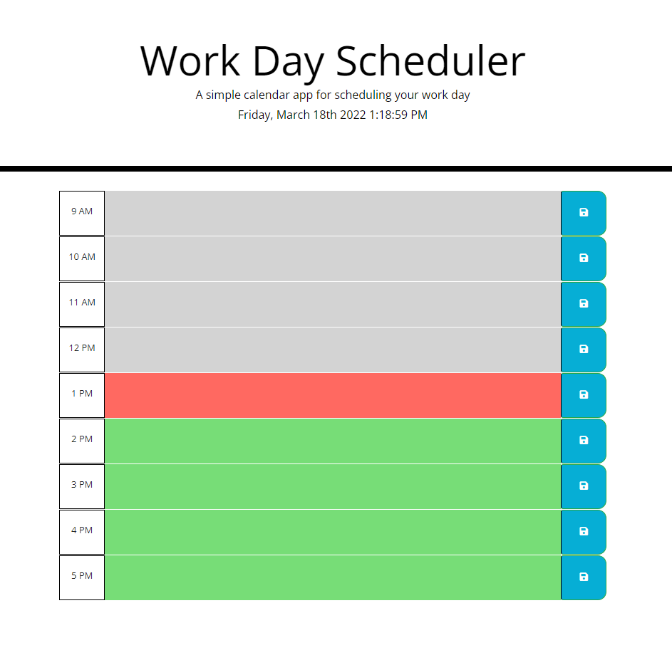
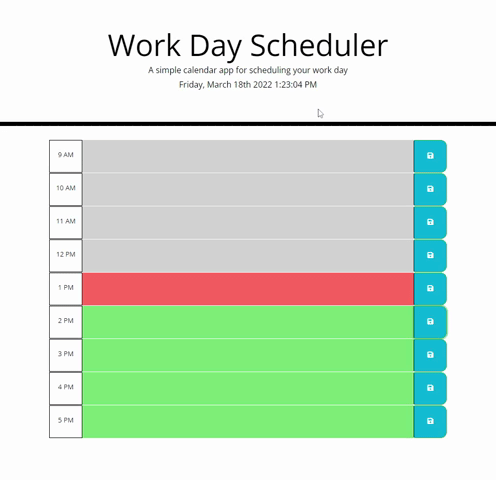

# Work Day Scheduler

### Never miss another meeting.

This application allows a user to load the page and view their local time of day dynamically change on their page. Below, there are task bars that allow users to input and save text as "tasks", which are then saved to their local storage. Because of this, the tasks remain even after refreshing the page.

With this project, I could have hard-coded each task bar. However, I like to challenge myself by coding with progression in mind. For example in this project, I used a for loop to loop through an arrays of possible hourly values in order to dynamically generate each task bar. In the future, if I wanted to add a task bar for the hours of 5am through 9am, I would only have to add a value for those hours into my looped array. If I had hard coded this portion, it would have resulted in a lot of repetitive code.

## Usage and Features

This is how the main page appears to users. The colors of the task bars dynamically change to alert users when deadlines are approaching. If the time has passed, the bar becomes greyed out. If the task bar represents the current hour, the bar becomes red. If the task bar is for a future event, the bar is green. The page updates asynchronously every minute to check the current time to decide if the colors must be updated in color.

If the user enters text into the input section and presses the save button, the task persists. Since it is saved to the user's local storage, it remains even after returning to the page at a later date.

## Deployed Site

Try it for yourself - <a href="https://ashlynn4567.github.io/Challenge5-WorkDayScheduler/">click here to start scheduling!<a>

## Suggestion Box

In the future, I would like to add the following improvements:

- I would like to add a "clear all" button so that users could clear multiple tasks at once.
- I would like to add a way where users could add a tag to the task, then filter their homepage by a certain type of task (i.e. work, home, school, and etc).

I'm a big believer in always refactoring code to improve it's functionality. If you would like to suggest your own improvements, you can reach me at the following links.

- <a href="mailto:ashlynn4567@gmail.com">Email<a>
- <a href="https://github.com/ashlynn4567">GitHub<a>
- <a href="https://www.linkedin.com/in/ashley-lynn-smith/">LinkedIn<a>

## Credits

For the base of this project, I used <a href="https://github.com/coding-boot-camp/super-disco">this initial codebase</a>, written by coding-boot-camp.
